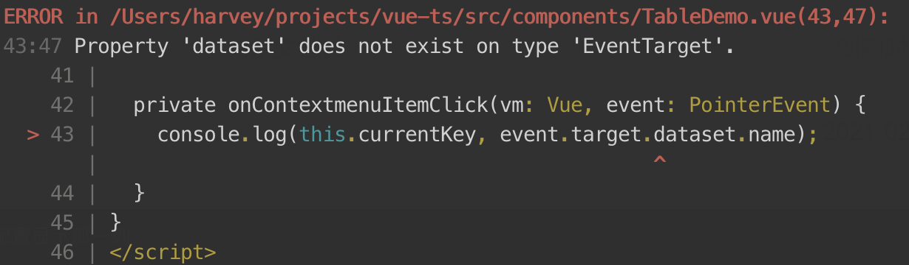

> Something about typescript.

## Property 'dataset' does not exist on type 'EventTarget'



```ts
private onContextmenuItemClick(vm: unknown, event: PointerEvent) {
  const target = event.target as HTMLElement;
  console.log(this.currentKey, target.dataset.name);
}

```
